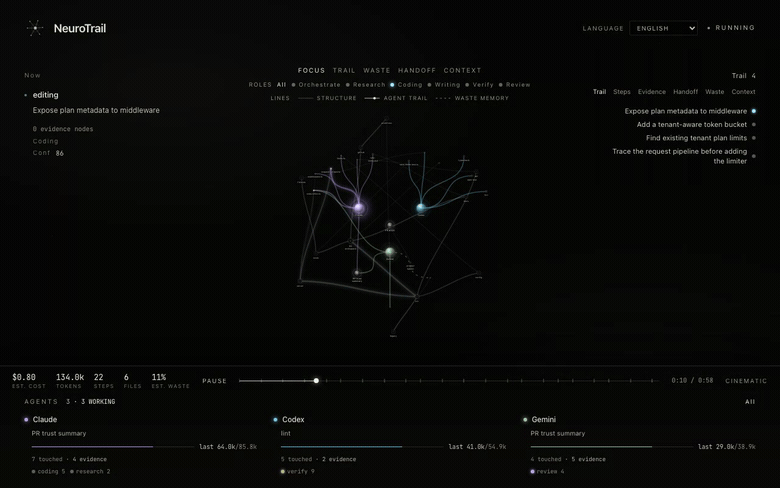
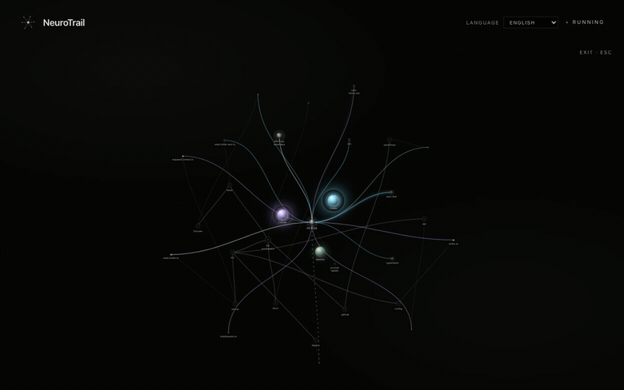

<div align="center">


# NeuroTrail

**Mira qué hizo realmente tu agente de código con IA y si puedes confiar en el cambio.**

Local-first. Multiagente. Sin instrumentación.

[](https://www.npmjs.com/package/neurotrail)
&nbsp;[](https://github.com/KF242131/neurotrail/actions/workflows/ci.yml)
&nbsp;[](LICENSE)

<p>
  🇺🇸 <a href="README.md">English</a>
  · 🇯🇵 <a href="README.ja-JP.md">日本語</a>
  · 🇨🇳 <a href="README.zh-CN.md">简体中文</a>
  · 🇰🇷 <a href="README.ko.md">한국어</a>
  · 🇩🇪 <a href="README.de.md">Deutsch</a>
  · 🇪🇸 Español
  · 🇫🇷 <a href="README.fr.md">Français</a>
  · 🇧🇷 <a href="README.pt-BR.md">Português</a>
</p>

<br/>


<br/><br/>

<table>
  <tr>
    <td width="50%">
      
    </td>
    <td width="50%">
      
    </td>
  </tr>
  <tr>
    <td><sub><strong>Mapa de tareas.</strong>La historia del PR con tres agentes se mantiene, usando la misma estructura de repositorio y árbol de archivos del visor en vivo.</sub></td>
    <td><sub><strong>Rastro de evidencia.</strong>Las alertas enlazan con el archivo, comando o artefacto exacto que las causó.</sub></td>
  </tr>
</table>

</div>

---

Cada vez más pull requests son escritos por agentes de IA. Los revisores reciben el **diff**, pero el diff no cuenta cómo llegó ahí el agente: qué exploró, qué descartó, si ejecutó las pruebas o dónde estuvo dando vueltas.

NeuroTrail reconstruye la ejecución del agente a partir de los logs locales que ya existen y genera dos artefactos para el revisor o el siguiente agente:

- **Resumen de confianza**: hechos verificables, comandos, pruebas reales, costo y alertas para revisión humana.
- **Replay autocontenido**: un HTML único que anima la ejecución como un grafo neuronal con línea de tiempo.

NeuroTrail no inicia ni controla agentes y no envía nada a la nube.

## Inicio rápido

Requisitos: Node.js 20+ y una sesión local de agente de código en este workspace.

```bash
npx neurotrail review

# desde un clon:
node bin/neurotrail.mjs review
```

Archivos generados:

- `.neurotrail/review/latest.md` - resumen para pegar en un PR
- `.neurotrail/reports/latest.html` - replay interactivo para compartir

## Visor en vivo

```bash
git clone https://github.com/KF242131/neurotrail.git
cd neurotrail
npm install
npm run dev
```

Abre `http://localhost:5173`. Sin una sesión activa muestra un replay de ejemplo; cuando detecta un agente soportado en el mismo workspace, cambia al modo en vivo.

## Idiomas

El visor detecta el idioma del navegador e incluye un menú de idioma en el encabezado. La UI soporta English, 日本語, Español, Français, Deutsch, Português, 한국어 y 中文. El HTML exportado hereda el idioma seleccionado.

El texto de logs, nombres de archivos, comandos y texto escrito por agentes se conserva en su idioma original para mantener la evidencia fiel.

## CLI

```bash
npx neurotrail review
npx neurotrail review --base main
npx neurotrail review --json
npx neurotrail review --comment 123
npx neurotrail report
npx neurotrail sessions
neurotrail watch
```

## Fuentes soportadas

Codex, Claude Code, Gemini, Cursor, Cline, Roo Code y Generic JSONL local del workspace.

## Privacidad

NeuroTrail lee archivos locales y escribe salidas locales. `review` aplica redacción básica por defecto. Revisa el HTML y Markdown antes de compartir un replay de un repositorio privado.

## Licencia

[MIT](LICENSE)
